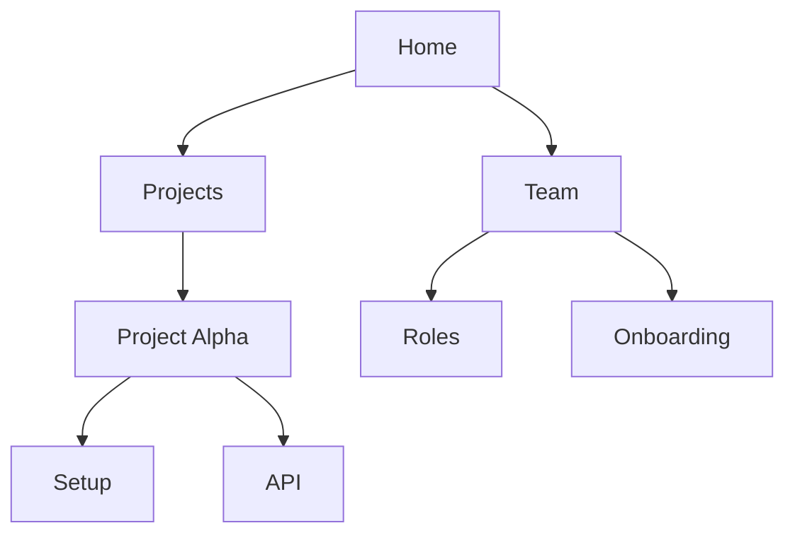

## Overview

José María Álvarez provides a robust documentation platform that helps you organize project knowledge, edit content seamlessly, track changes, and collaborate with teams. You gain access to intuitive tools for building structured docs that scale with your projects.

<Columns cols={2}>
  <Card title="Organize Pages" icon="layers" href="#page-organization">
    Create hierarchies and navigate complex documentation structures effortlessly.
  </Card>
  <Card title="Edit with Ease" icon="edit-3" href="#content-editing">
    Use visual and markdown editors tailored for technical content.
  </Card>
  <Card title="Track Changes" icon="git-branch" href="#version-control">
    Maintain version history to revert or review edits anytime.
  </Card>
  <Card title="Collaborate" icon="users" href="#collaboration">
    Share docs securely and invite team members with granular permissions.
  </Card>
</Columns>

## Page Organization and Hierarchies

You organize your documentation into intuitive hierarchies, mimicking a file system with pages, subpages, and sections. This structure keeps content discoverable, even as your project grows to hundreds of pages.

Use nested pages to group related topics. For example, place API references under a "Developer" parent page, with endpoints as children.



<Steps>
  <Step title="Create Hierarchy" icon="folder-plus">
    Navigate to your workspace. Click "New Page" and select a parent to nest it.
  </Step>
  <Step title="Reorder Pages" icon="move">
    Drag pages in the sidebar to adjust the hierarchy. Changes save automatically.
  </Step>
  <Step title="Publish Structure" icon="eye">
    Preview the navigation menu to ensure logical flow for readers.
  </Step>
</Steps>

## Content Editing Tools

Edit content using flexible tools that suit your workflow. Switch between visual WYSIWYG for quick drafts and markdown for precise control.

<Tabs>
  <Tab title="Visual Editor" icon="edit">
    Drag-and-drop images, format text, and insert components without code.
    
    <Callout kind="tip">
      Use the toolbar for bold, lists, and embeds to speed up authoring.
    </Callout>
  </Tab>
  <Tab title="Markdown Editor" icon="code">
    Write in standard markdown with live preview. Supports advanced syntax like tables and code blocks.
  </Tab>
</Tabs>

<CodeGroup tabs="Markdown,HTML">
  ```markdown
  ## Heading

  - List item
  - Another item

  | Feature | Benefit |
  |---------|---------|
  | Hierarchies | Easy navigation |
  ```
  ```html
  <h2>Heading</h2>
  <ul>
    <li>List item</li>
    <li>Another item</li>
  </ul>
  <table>
    <tr><th>Feature</th><th>Benefit</th></tr>
    <tr><td>Hierarchies</td><td>Easy navigation</td></tr>
  </table>
  ```
</CodeGroup>

## Version Control and History

Every edit creates a version snapshot, allowing you to track changes, compare diffs, and restore previous states. This prevents data loss and supports auditing.

<Expandable title="View Change History" default-open="true">
  Right-click a page in the sidebar and select "History." Browse commits by date, author, or summary.
  
  Revert by clicking "Restore this version." You receive notifications for major changes from collaborators.
</Expandable>

<Callout kind="info">
  Version history retains up to 100 snapshots per page. Export diffs as JSON for external tools.
</Callout>

## Collaboration and Sharing Options

Invite team members to co-edit docs in real-time. Set permissions like view-only, edit, or admin per page or workspace.

<Tabs>
  <Tab title="Invite Users" icon="user-plus">
    Go to workspace settings > Members. Enter emails and assign roles.
  </Tab>
  <Tab title="Share Links" icon="share-2">
    Generate public or password-protected links. Track views and edits.
  </Tab>
</Tabs>

| Option | Permissions | Use Case |
|--------|-------------|----------|
| Workspace Invite | Full access | Core team |
| Page Share | View/Edit | Clients |
| Public Link | Read-only | Documentation |

Start by organizing your first hierarchy, then invite collaborators to build together. For more, see [quickstart](/quickstart).